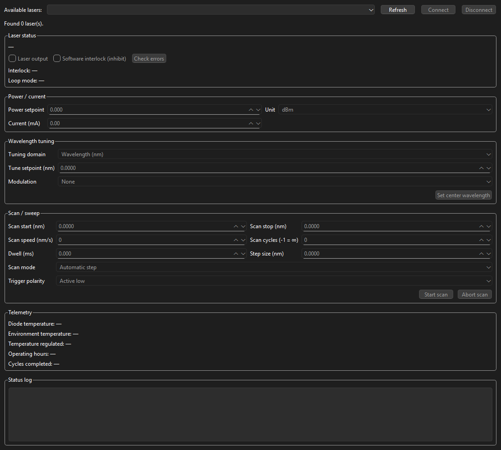

# Lasers — New Focus TLB-8800 driver

Python control library for **New Focus TLB-8800** tunable lasers over USB serial, using the instrument **Legacy** protocol (manual §5.3–5.4).

Repository: [github.com/MarKo7s/lasers](https://github.com/MarKo7s/lasers)

## Features

- COM port **discovery** driven by `supported_models.json`
- **`TLB8800`** connection class with `read` / `set` command facades
- **`LaserSpecs`** snapshot (auto-loaded on connect) — wavelength range, scan limits, control mode
- Session **logging** under `ProgramData`
- Jupyter notebooks for interactive testing (`discover_lasers.ipynb`, `tests/pyside_widget.ipynb`)
- **NiceGUI** and **PySide6** control widgets (`laser.ui.nicegui`, `laser.ui.pyside`)

## Requirements

- Windows (tested) with USB serial (COM port)
- Python 3.11
- [pyserial](https://pyserial.readthedocs.io/)

## Installation

Pip name is **`lasers`**; after install, import as **`laser`**.

From GitHub (pinned tag):

```bash
pip install "lasers[ui,notebooks] @ git+https://github.com/MarKo7s/lasers.git@v2.0.1"
```

Editable checkout (from the `Laser` folder):

```bash
pip install -e ".[ui,notebooks]"
```

Conda env (Python + pip only; the package comes from the git tag in `environment.yml`):

```bash
conda env create -f environment.yml
conda activate lasers_env
```

```python
from laser.discovery import LaserDiscovery
from laser.newfocus import TLB8800
from laser.ui.pyside import LaserControlWidget
```

## NiceGUI laser widget

Dark-themed control panel: USB discovery, connect, spec-driven bounds (power/current, tune, scan), status log, and live telemetry.

**Standalone demo** (from the `Laser` folder, with `lasers_env` active):

```bash
python -m laser.ui.nicegui.app
```

Open http://localhost:8080 in a browser.

**Embed in another NiceGUI app:**

```python
from nicegui import ui
from laser.ui.nicegui import create_laser_widget

with ui.column():
    create_laser_widget()
```

Shared logic lives in `laser.core`: generic `DiscoveryService` and `create_laser_controller()`, with TLB-8800 specifics under `laser.core.tlb8800` (`TLB8800Controller`, `bindings_from_specs`).

## PySide laser widget

Same control panel as NiceGUI, as a Qt widget. Standalone demo:

```bash
python -m laser.ui.pyside.app
```

**Discovery mode** (user Connects in the GUI):

```python
from laser.ui.pyside import LaserControlWidget

widget = LaserControlWidget()
widget.show()
```

**Already connected** — pass a live `TLB8800`; the panel starts in the connected state (device menu shows that laser). **Disconnect** closes the serial port so Refresh can find it again (`laser.is_open` becomes `False`):

```python
from laser.discovery import LaserDiscovery
from laser.newfocus import TLB8800
from laser.ui.pyside import LaserControlWidget

port = next(iter(LaserDiscovery().discover()))
laser = TLB8800.connect(port)
widget = LaserControlWidget(laser)
widget.show()
# widget.laser is laser
```

After notebook `laser.set.*` calls, lock the panel so cells cannot fight the script, then pull instrument values back:

```python
gui.remotecontrol(True)
laser.set.current(80)
gui.sync_gui_panel_to_laser()
gui.remotecontrol(False)
```

See `tests/pyside_widget.ipynb` for a Jupyter walkthrough (`%gui qt`).

<!-- gui-screenshot:start -->

<!-- gui-screenshot:end -->

### Project layout (`core` and UI)

| Path | Role |
|------|------|
| `core/discovery_service.py` | USB scan → `DiscoveredDevice` list |
| `core/factory.py` | `create_laser_controller(device)` by model |
| `core/models.py` | Shared `DiscoveredDevice`, `StatusMessage` |
| `core/tlb8800/` | TLB-8800 controller, UI bindings, enum labels |
| `ui/nicegui/` | NiceGUI widget (`python -m laser.ui.nicegui.app`) |
| `ui/pyside/` | PySide6 widget (`python -m laser.ui.pyside.app`) |

## Quick start

```python
from laser.discovery import LaserDiscovery
from laser.newfocus import TLB8800

# Find lasers on USB COM ports → {port: idn_string}
lasers = LaserDiscovery().discover()
port = next(iter(lasers))

# Connect (specs refreshed automatically)
laser = TLB8800.connect(port)

print(laser.specs.current_control)
print(laser.specs.wavelength_min, "-", laser.specs.wavelength_max, "nm")

laser.set.tune(842)
if laser.specs.current_control:
    laser.set.current(80)
else:
    laser.set.power(-3)

result = laser.ON()
print(result.ok, result.message)

laser.OFF()
laser.close()
```

Context manager:

```python
with TLB8800.connect(port) as laser:
    laser.set.tune(842)
    laser.ON()
```

## Laser control concepts

### Loop mode (power vs current)

The laser regulates output either by **optical power** or **diode current**:

| `loop?` | `LoopMode` | Control | Set command |
|--------|------------|---------|-------------|
| `0` | `CONSTANT_POWER` | Power feedback | `laser.set.power(value)` |
| `1` | `CONSTANT_CURRENT` | Fixed current | `laser.set.current(mA)` |

Use **`laser.specs.current_control`** (`True` when loop mode is `1`) to pick the right setter:

```python
if laser.specs.current_control:
    laser.set.current(80)
else:
    laser.set.power(-3)
```

In current-control mode, `pwr?` returns a misleading `0` — `laser.specs.power` and `power_unit` are stored as `None`.

### Interlock and output

Software interlock often blocks emission until cleared:

```python
laser.set.software_interlock(False)   # int 0 — allow operation
laser.set.laser_output(True)          # laz 1
# or
laser.ON(clear_interlock=True)
```

Check state with `laser.read.interlock_state()` and `laser.read.laser_output()`.

### Read vs set

| Facade | On failure | Return type |
|--------|------------|-------------|
| `laser.read.*` | Raises (`TLB8800ParseError`, `TimeoutError`, …) | Typed values |
| `laser.set.*` | Does **not** raise on protocol errors | `CommandResult` |

Always check set results:

```python
result = laser.set.tune(842)
if not result.ok:
    print(result.message, result.error_codes)
```

Legacy set responses: `*` accepted, `&` execution error, `!` unknown command, `#` bad argument. Details are in `err?` (semicolon-separated codes).

### LaserSpecs

`TLB8800.connect(..., refresh_specs=True)` queries the laser and fills `laser.specs`. Call `laser.refresh_specs()` after changing settings.

- **`None`** means unsupported or query failed — not a numeric zero.
- In **current-control** mode, `power` and `power_unit` are intentionally `None`.
- `err?` is queried last (clears the error buffer).

### Wavelength and scans

```python
laser.set.tuning_domain(TuningDomain.WAVELENGTH)  # unit 0
laser.set.tune(842, wait=True)                  # blocks until opc? complete

laser.set.scan_start(835)
laser.set.scan_stop(852)
laser.set.scan_speed(10)
laser.set.start_scan()
```

Wavelength limits: `laser.specs.wavelength_min` / `wavelength_max` (from `wmin?` / `wmax?`).  
Scan speed limits: `scan_speed_min` / `scan_speed_max` (from `spmin?` / `spmax?`).

## Common workflows

### 1. Discover and connect

```python
from laser.discovery import LaserDiscovery, list_usb_ports
from laser.newfocus import TLB8800

print(list_usb_ports())
lasers = LaserDiscovery().discover()
port, idn = next(iter(lasers.items()))
laser = TLB8800.connect(port)
```

### 2. Inspect capabilities

```python
s = laser.specs
print(s.identity)
print("Current control:", s.current_control)
print("λ range:", s.wavelength_min, "-", s.wavelength_max)
print("Scan speed:", s.scan_speed_min, "-", s.scan_speed_max)
print("Current:", s.current, "mA (max", s.current_max, ")")

laser.refresh_specs()  # after manual changes
```

### 3. Turn laser on safely

```python
laser.set.software_interlock(False)
laser.set.tune(842, wait=True)
if laser.specs.current_control:
    laser.set.current(80)
else:
    laser.set.power(-3)
laser.ON(clear_interlock=False)
```

### 4. Wavelength sweep

```python
from laser.newfocus import ScanMode

laser.set.scan_start(835)
laser.set.scan_stop(852)
laser.set.scan_speed(5)
laser.set.scan_mode(ScanMode.UNI_FORWARD)
laser.set.start_scan(wait=True)
```

### 5. Handle failed commands

```python
result = laser.set.laser_output(True)
if not result.ok:
    for code, msg in zip(result.error_codes, result.error_messages):
        print(code, msg)
laser.clear_errors()
```

## API reference

### Discovery (`laser.discovery`)

| Symbol | Description |
|--------|-------------|
| `LaserDiscovery(config_path=None, baudrate=None, timeout=...)` | Load `supported_models.json` |
| `.discover(ports=None)` | Return `{com_port: idn_string}` for supported models |
| `.probe_port(port)` | Return `(idn, SupportedModel)` or `None` |
| `.list_usb_ports()` | USB COM ports (falls back to all COM ports) |
| `.supported_models` | Tuple of configured models |
| `.config_path` | Path to JSON config |
| `discover()` | Module-level shortcut |
| `list_usb_ports()` | Module-level shortcut |

### `TLB8800` (`laser.newfocus`)

| Method / property | Description |
|-------------------|-------------|
| `TLB8800.connect(port, baudrate=115200, timeout=..., enable_log=True, refresh_specs=True)` | Open serial connection |
| `.read` | `TLBReadCommands` facade |
| `.set` | `TLBSetCommands` facade |
| `.specs` | Cached `LaserSpecs` (requires prior refresh) |
| `.refresh_specs()` | Re-query laser and update `.specs` |
| `.identity` | `LaserIdentity` from `id?` |
| `.ON(clear_interlock=True)` | Clear interlock (optional) and enable output |
| `.OFF()` | Disable laser output |
| `.wait_until_complete(poll_interval=0.05, timeout=120)` | Poll `opc?` until done |
| `.set_logger_level("DEBUG" \| "INFO")` | Session log verbosity |
| `.clear_errors()` | Read and clear `err?` queue |
| `.raise_if_error()` | Raise if any error code ≠ 0 |
| `.describe_error_code(code)` | Human-readable error text |
| `.reboot()` | Send reboot command |
| `.port`, `.laser_id`, `.log_path` | Connection metadata |
| `.close()` | Release serial port and log file |

### `laser.read.*` — queries

Raises on timeout/parse errors. Grouped by function.

#### System

| Method | Returns | Legacy |
|--------|---------|--------|
| `identify()` | `LaserIdentity` | `id?` |
| `operation_complete()` | `int` | `opc?` |
| `interlock_state()` | `InterlockState` | `int?` |
| `laser_output()` | `bool` | `laz?` |
| `loop_mode()` | `LoopMode` | `loop?` |

#### Power and current

| Method | Returns | Legacy |
|--------|---------|--------|
| `power()` | `float` | `pwr?` |
| `power_min()` | `float` | `pmin?` |
| `power_max()` | `float` | `pmax?` |
| `power_unit()` | `PowerUnit` | `pwru?` |
| `current()` | `float` | `crnt?` |
| `current_max()` | `float` | `crntmax?` |

#### Tuning

| Method | Returns | Legacy |
|--------|---------|--------|
| `tuning_domain()` | `TuningDomain` | `unit?` |
| `wavelength_min()` | `float` | `wmin?` |
| `wavelength_max()` | `float` | `wmax?` |
| `tune_setpoint()` | `float` | `wave?` |
| `modulation_source()` | `ModulationSource` | `sms?` |

#### Scan / sweep

| Method | Returns | Legacy |
|--------|---------|--------|
| `scan_start()` | `float` | `str?` |
| `scan_start_acceleration_offset()` | `float` | `staccoff?` |
| `scan_stop()` | `float` | `stop?` |
| `scan_stop_deceleration_offset()` | `float` | `stdecoff?` |
| `scan_step_size()` | `float` | `step?` |
| `scan_mode()` | `ScanMode` | `mode?` |
| `scan_speed()` | `float` | `spd?` |
| `scan_speed_min()` | `float` | `spmin?` |
| `scan_speed_max()` | `float` | `spmax?` |
| `scan_dwell_time_ms()` | `float` | `dwl?` |
| `scan_cycles()` | `int` | `num?` |
| `scan_cycles_count()` | `int` | `cnt?` |

#### Temperature, triggers, lifetime, errors

| Method | Returns | Legacy |
|--------|---------|--------|
| `laser_diode_temperature_setpoint()` | `float` | `tset?` |
| `laser_diode_temperature()` | `float` | `tmp?` |
| `environment_temperature()` | `float` | `tmpe?` |
| `temperature_regulated()` | `bool` | `treg?` |
| `fan_override()` | `bool` | `for?` |
| `fan_speed()` | `FanSpeed` | `fspd?` |
| `trigger_polarity()` | `TriggerPolarity` | `trpol?` |
| `trigger_a_enabled()` | `bool` | `traen?` |
| `trigger_b_enabled()` | `bool` | `trben?` |
| `operating_hours()` | `float` | `ophours?` |
| `error_count()` | `int` | `errcnt?` |
| `all_error_codes()` | `list[int]` | `err?` |

### `laser.set.*` — commands

All return **`CommandResult`** (check `.ok`). Does not raise on `&`, `!`, `#`.

| Method | Legacy | Notes |
|--------|--------|-------|
| `software_interlock(inhibit)` | `int 0/1` | `True` = inhibit |
| `laser_output(enabled)` | `laz 0/1` | |
| `power(value)` | `pwr` | Constant-power mode |
| `power_unit(unit)` | `pwru` | `PowerUnit.DBM` or `.MW` |
| `current(milliamps)` | `crnt` | Constant-current mode |
| `tuning_domain(domain)` | `unit` | `TuningDomain.WAVELENGTH` / `.FREQUENCY` |
| `tune(setpoint, wait=True)` | `wave` | Waits for `opc?` when `wait=True` |
| `modulation_source(source)` | `sms` | |
| `scan_start(setpoint)` | `str` | |
| `scan_start_acceleration_offset(offset)` | `staccoff` | |
| `scan_stop(setpoint)` | `stop` | |
| `scan_stop_deceleration_offset(offset)` | `stdecoff` | |
| `scan_step_size(step)` | `step` | |
| `scan_mode(mode)` | `mode` | `ScanMode` enum |
| `scan_speed(speed)` | `spd` | |
| `scan_dwell_time_ms(dwell_ms)` | `dwl` | |
| `scan_cycles(cycles)` | `num` | `-1` = infinite |
| `start_scan(wait=False)` | `scan` | |
| `abort_scan()` | `abort` | |
| `next_scan_step()` | `next` | |
| `trigger_polarity(polarity)` | `trpol` | |
| `trigger_a_enabled(enabled)` | `traen` | |
| `trigger_b_enabled(enabled)` | `trben` | |
| `preset()` | `rst` | Factory preset |

### `CommandResult`

| Field | Description |
|-------|-------------|
| `ok` | `True` when response is `*` |
| `command` | Command string sent |
| `response` | Raw response character(s) |
| `message` | Human-readable interpretation |
| `error_codes` | Tuple of codes from `err?` (if failed) |
| `error_messages` | Tuple of descriptions |

### `LaserSpecs` (key fields)

Full definition: `laser.newfocus.tlb8800_utilities.types`.

| Field | Description |
|-------|-------------|
| `current_control` | `True` → use `set.current`; `False` → use `set.power` |
| `loop_mode` | Raw loop mode enum |
| `identity` | Parsed IDN |
| `wavelength_min`, `wavelength_max` | Tuning range (nm) |
| `tune_setpoint` | Current wavelength setpoint |
| `scan_speed_min`, `scan_speed_max` | Allowed sweep speeds |
| `power`, `power_unit` | `None` in current-control mode |
| `current`, `current_max` | Diode current (mA) |
| `laser_output`, `interlock_state` | Output and safety state |
| `error_codes` | Last error queue snapshot |

### Enums (`laser.newfocus.tlb8800_utilities.types`)

| Enum | Values |
|------|--------|
| `LoopMode` | `CONSTANT_POWER=0`, `CONSTANT_CURRENT=1` |
| `PowerUnit` | `DBM=0`, `MW=1` |
| `TuningDomain` | `WAVELENGTH=0`, `FREQUENCY=1` |
| `ScanMode` | `AUTOMATIC_STEP=1`, `UNI_FORWARD=2`, `BI_DIRECTIONAL=3`, `UNI_REVERSE=4` |
| `InterlockState` | `BOTH_OFF=0`, `SOFTWARE_ACTIVE=1`, `HARDWARE_ACTIVE=2`, `BOTH_ACTIVE=3` |
| `ModulationSource` | `NONE=0`, `COHERENCE_CONTROL=1`, `EXTERNAL_ANALOG=3` |
| `TriggerPolarity` | `ACTIVE_LOW=0`, `ACTIVE_HIGH=1` |
| `FanSpeed` | `OFF=0`, `LOW=1`, `MEDIUM=2`, `HIGH=3` |

Import from `laser.newfocus`:

```python
from laser.newfocus import LoopMode, PowerUnit, ScanMode, TuningDomain
```

## Session logging

When `enable_log=True` (default):

- Logs under `C:\ProgramData\LAB\hardware\lasers\TLB8800\logs\<laser_id>.log`
- **INFO**: connect/disconnect, warnings, errors
- **DEBUG**: every read/set line (`laser.set_logger_level("DEBUG")`)

Disable logging: `TLB8800.connect(port, enable_log=False)`.

## Project layout

```
Laser/
├── README.md
├── pyproject.toml            # pip name lasers; import prefix laser
├── discovery.py              # laser.discovery
├── supported_models.json
├── discover_lasers.ipynb
├── tests/pyside_widget.ipynb
├── environment.yml
├── requirements.txt
├── docs/images/gui.png       # PySide widget screenshot
├── scripts/release.py
├── scripts/capture_gui.py
├── core/                     # laser.core
├── ui/                       # laser.ui.nicegui / laser.ui.pyside
└── newfocus/
    ├── TLB8800.py            # laser.newfocus.TLB8800
    └── tlb8800_utilities/
```

## Adding laser models

Edit `supported_models.json`:

```json
{
  "baudrate": 115200,
  "models": [
    {
      "model": "TLB-8800",
      "idn_query": "*IDN?",
      "match": "TLB-8800"
    }
  ]
}
```

Discovery picks up new entries automatically. A dedicated driver class under `laser.newfocus` is added when a model needs a different command set or protocol.

## Notebook

Open `discover_lasers.ipynb` from the project folder with the `lasers_env` kernel for step-by-step discovery, connection, and command trials. Open `tests/pyside_widget.ipynb` for the PySide widget (empty launch vs pass a connected `TLB8800`).

## Versioning

- Version source of truth: `pyproject.toml` (`[project].version`)
- Changelog: `CHANGELOG.md`
- Git tags: `vX.Y.Z` (example: `v2.0.1`)
- `__init__.py` reads version from installed metadata (`importlib.metadata.version("lasers")`)
- Do not hand-edit `__init__.py` version except as a source-tree fallback

## Releasing

```bash
python scripts/release.py --from-changelog
```

This pushes `main`, creates annotated tag `v{version}` from `pyproject.toml`, and pushes the tag. GitHub then builds the tarball from that tag.

Optional GitHub Release:

```bash
gh release create v2.0.1 --title "lasers 2.0.1" --notes-file CHANGELOG.md
```
